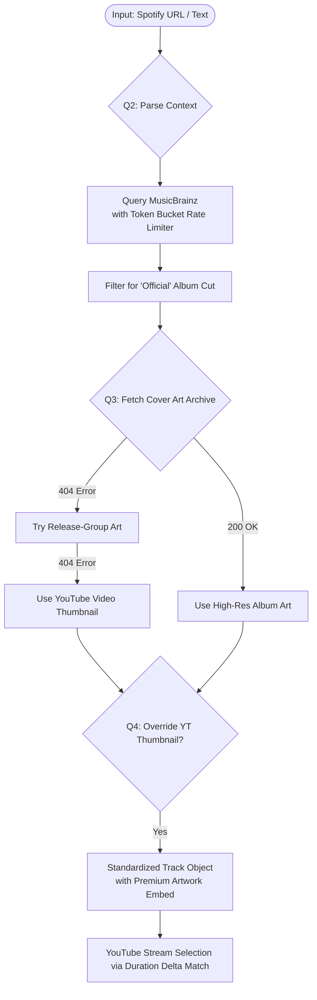

# 🔄 MusicBrainz Audio Engine Integration Blueprint

This document details the complete structural rerouting of the Voxaria Audio Engine. By utilizing MusicBrainz as the canonical metadata brain, the system preserves its strict studio-cut matching algorithm without relying on authenticated third-party streaming APIs.



## 🧠 The Deep-Match Algorithm Flow

The resolution pipeline operates as a strict sequence of conditional filters:
1. **Normalization Stage:** The raw text input or web URL is scrubbed.
2. **Metadata Harvest (MusicBrainz):** The bot queries the open encyclopedia and pulls the official release entry to capture the exact studio tracking records.
3. **YouTube Broad Scan:** The bot queries standard YouTube for raw stream options.
4. **The Triple-Filter Match:**
   - **Filter 1 (Title):** Drops records that do not contain core song title components.
   - **Filter 2 (Artist):** Ranks and matches the primary artist credit to filter out covers.
   - **Filter 3 (Duration Delta):** Evaluates the absolute runtime difference. If $|YT_{\text{duration}} - MB_{\text{duration}}| \le 3\text{ seconds}$, the stream is confirmed as the official studio cut.

---

## 🛠️ Codebase Integration & Rerouting Details

To implement this pivot, several existing modules in the Voxaria Audio Engine must be refactored, and a new structure will be introduced.

### 1. 📂 Structure: `src/musicbrainz/` Directory
All MusicBrainz query, client, token bucket rate-limiting, and Cover Art Archive resolution logic will be encapsulated inside a new directory: [src/musicbrainz/](file:///c:/Bot/MusicBot/src/musicbrainz).

*   `src/musicbrainz/MusicBrainzClient.js`: Responsible for raw HTTP GET requests to the MusicBrainz endpoints, incorporating a robust Token Bucket rate limiter (1 request per second compliant with MusicBrainz TOS).
*   `src/musicbrainz/CoverArtResolver.js`: Handles checking the Cover Art Archive for release MBIDs, falling back to release-group MBIDs on `404` errors, and gracefully defaulting to YouTube thumbnails if no premium art is found.

### 2. 📇 Introducing MusicBrainz Query & API Sourcing
Instead of initializing `spotify-web-api-node` and verifying token expirations (which fail on free-tier developer accounts), we will query the MusicBrainz XML/JSON Web Service.

*   **API Endpoint:** `https://musicbrainz.org/ws/2/recording/`
*   **Query Syntax:**
    `https://musicbrainz.org/ws/2/recording/?query=recording:"<TITLE>" AND artist:"<ARTIST>"&fmt=json`
*   **Requirements:**
    *   **User-Agent Header:** MusicBrainz requires a descriptive `User-Agent` header (e.g., `VoxariaMusicBot/1.0.0 (contact@example.com)`). Failing to provide this results in immediate HTTP `403` or `503` rate-limiting.
    *   **Fallback Search:** If a full query returns no results, fall back to searching by recording title alone, then sorting records by popularity or release type (e.g., preference for studio album releases over live recordings).

### 2. 🎨 Cover Art Archive Integration
To preserve the premium look of the Voxaria dashboard, we will pull down high-quality album art using the free Cover Art Archive API linked to MusicBrainz release/release-group IDs.

*   **Step 1: Extract the Release ID from MusicBrainz**
    The returning JSON data from the MusicBrainz API recording query includes a nested hierarchy. We will parse this structure to extract the first available Release ID (`releaseMbid`) or Release Group ID:
    ```javascript
    // Navigating the MusicBrainz JSON response matrix
    const releaseMbid = response.data.recordings[0].releases[0].id;
    // Returns a UUID like: "c1860dcc-9d62-4217-91a5-83e87053cdae"
    ```

*   **Step 2: Plug the ID Into the Cover Art Template String**
    The Cover Art Archive requires no authentication or API tokens. We inject the UUID into standard URL blueprints:
    *   *Release Edition Front Cover:* `https://coverartarchive.org/release/${releaseMbid}/front`
    *   *Release Group Front Cover:* `https://coverartarchive.org/release-group/${releaseGroupMbid}/front`

*   **Step 3: Handle Automatic Gateway Redirection**
    The Cover Art Archive acts as a dynamic router redirecting client requests (HTTP `307 Temporary Redirect`) to actual image binaries hosted on Internet Archive servers. The browser or Discord embeds follow this redirect seamlessly.

*   **Step 4: Downsample for UI Performance**
    To avoid lagging the dashboard with uncompressed 10MB images, append dimension suffixes for optimized, fast-loading thumbnails:
    *   *UI Cards / Small Thumbnails (250px):*
        ```javascript
        const finalCoverUrl = `https://coverartarchive.org/release/${releaseMbid}/front-250`;
        ```
    *   *Main Player Panel (500px):*
        ```javascript
        const finalCoverUrl = `https://coverartarchive.org/release/${releaseMbid}/front-500`;
        ```

### 3. 🔀 Rerouting in `src/player/StreamResolver.js`
In [StreamResolver.js](file:///c:/Bot/MusicBot/src/player/StreamResolver.js), Spotify track resolution currently redirects to `YouTube.resolveSpotifyTrack`. We will update this flow to use MusicBrainz metadata lookup:

*   **Platform Detection:** Keep the Spotify URL parser to allow users to paste Spotify links, but instead of calling Spotify API to retrieve metadata details (like title, artist, and duration), use a lightweight metadata scraping solution or prompt the MusicBrainz API to find matches via the track name if extracted from the link (or fall back gracefully).
*   **Text Queries:** For free-form text search queries, instead of searching Spotify first, query the MusicBrainz service to grab the canonical Title, Artist, and Duration (in seconds).
*   **Interface Mapping:** Update `StreamResolver.resolveStream` to map the MusicBrainz metadata record to the standardized internal `Track` object format.

### 4. 🛡️ Updating the Triple-Filter Matcher in `src/YouTube.js`
The `resolveSpotifyTrack` method in [YouTube.js](file:///c:/Bot/MusicBot/src/YouTube.js#L44) should be generalized to `resolveMetadataTrack` (or supplemented with `resolveMusicBrainzTrack`):

*   **Input Signature:** Accepts `(title, artists, durationMs, thumbnail, guildId)`.
*   **Strict Duration Filter:**
    The duration returned from MusicBrainz is in milliseconds (extracted from the recording length). The filter in `YouTube.js` will compare the parsed `yt-dlp` candidate durations with this studio-length reference.
    ```javascript
    const deltaSeconds = Math.abs(candidateDurationMs - musicBrainzDurationMs) / 1000;
    const isDisqualified = deltaSeconds > 3.0;
    ```
*   **Scoring Adjustments:**
    *   Candidate titles containing keywords like "live", "remix", "cover", "acoustic" are penalized/excluded.
    *   Topic channels and official uploaders receive bonus weight scores.
    *   The candidate with the lowest score (closest duration drift and official source confirmation) is locked as the target stream.

