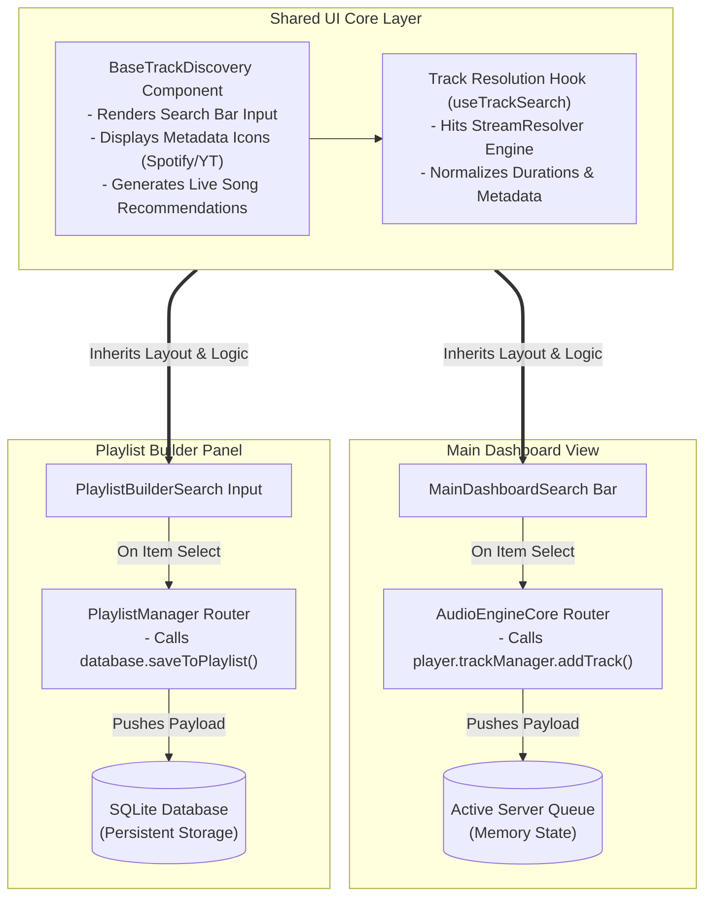

# UI Loader Architecture

This document outlines the user interface components, data resolution hooks, and routing behavior for the track discovery interface.

## System Architecture Diagram

---

## Technical Details

### 1. Shared UI Core Layer
* **BaseTrackDiscovery Component:** Manages the general user search input, rendering metadata indicators (Spotify vs. YouTube icons), and surfacing recommended tracks.
* **Image Fallbacks:** Track preview images default to high-fidelity **Spotify album covers** to maintain a clean and uniform visual style.
* **Track Resolution Hook (`useTrackSearch`):** Interfaces directly with the backend `StreamResolver` to normalize metadata (titles, artists, and durations) across source platforms.

### 2. Media Routing Logic
* **Direct Links:** When a query is identified as a direct link (such as a YouTube video URL), the system bypasses standard metadata lookup/search queries and routes the request directly to the YouTube stream resolver.
* **Metadata Queries:** Standard search queries utilize the Spotify catalog first, defaulting to Spotify artwork previews, before executing duration-matched YouTube streams during active playback.

### 3. Application Routes
* **Live Queue Route (Main Dashboard):** When a track is selected for immediate playing, the payload is directed to the `AudioEngineCore Router`, calling `player.trackManager.addTrack()` to load it into active memory state.
* **Storage Route (Playlist Builder):** When adding to a playlist, the payload is directed to the `PlaylistManager Router`, calling `database.saveToPlaylist()` to store the track metadata persistently in the SQLite database.
