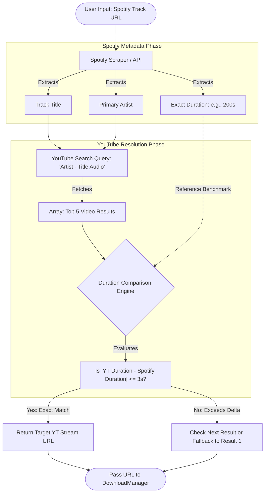

# Spotify to YouTube Audio Resolution & Download Flow

This document details the workflow used to resolve a Spotify track URL to the most accurate YouTube audio stream for downloading.

## Workflow Diagram

---

## Detailed Resolution Process

1. **Spotify Metadata Extraction**
   * **Trigger:** The user provides a Spotify track URL.
   * **Action:** The bot queries/scrapes the Spotify API to retrieve three strict data attributes:
     * **Track Title**
     * **Primary Artist**
     * **Exact Duration** (in seconds)

2. **Targeted YouTube Query Generation**
   * **Action:** The system formats a search query designed to target standard audio tracks rather than cinematic music videos.
   * **Format:** `"[Primary Artist] - [Track Title] audio"` (e.g., `"The Weeknd - Blinding Lights audio"`).

3. **Duration Delta Matching (The Selection Engine)**
   * **Action:** The bot retrieves the top 3 to 5 YouTube search results.
   * **Purpose:** To filter out live versions, covers, and official music videos containing dialogue or long cinematic intros/outros.
   * **Evaluation:** The duration of each YouTube video is compared directly against the Spotify benchmark duration.

4. **Optimal Stream Selection**
   * **Logic:** The engine enforces a strict tolerance threshold of `+/- 3 seconds` (`|YT Duration - Spotify Duration| <= 3s`).
   * **Resolution:**
     * **Match Found:** The YouTube video with the absolute smallest duration delta within the 3-second limit is selected.
     * **Fallback:** If no videos meet the strict 3-second delta, the bot checks the next available search results, ultimately falling back to the first search result if no strict match can be established.
   * **Output:** The resolved YouTube stream URL is forwarded to the `DownloadManager` for audio ingestion.
